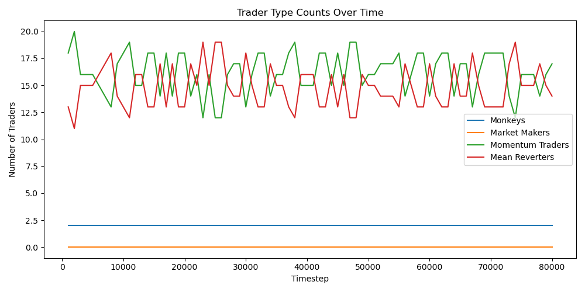

Market Simulation Engine
========================

Overview
--------
This is market simulation framework written in C++ for exploring emergent behavior in simplified financial markets. It includes multiple agent types with distinct strategies, an order matching engine, and trade history output for visualization and analysis.

Agent Types
-----------
- **Market Makers**: Provide liquidity via bid/ask around a fundamental price (with optional drift)
- **Monkeys**: Noise traders placing random buy/sell orders around the market price.
- **Mean Reverters**: Buy when short MA < long MA, sell when short MA > long MA.
- **Momentum Traders**: Buy when short MA > long MA, sell when short MA < long MA.

Run
```
cd src
g++ -std=c++17 main.cpp market.cpp -o market && ./market && python3 ../scripts/visualize.py
```

